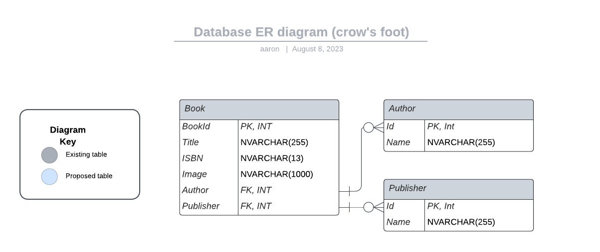

# Bookstore Application Repository
## Introduction

Welcome to the Bookstore Application repository. This project aims to provide a robust and scalable application for managing books. The initial design centers on a normalized model with primary emphasis on data integrity and efficiency.
### Features

    Simple and normalized data model.
    Support for tracking books, authors, and publishers.
    Scalable design ready for future enhancements.

## Application Overview

The Bookstore Application revolves around three primary entities: Books, Authors, and Publishers.

## Functional Requirements & User Experience
### Books:

    Create a Book:
        Users can add a new book to the system.
        They will provide the title, select an author from a list or add a new one, select a publisher from a list or add a new one, upload or link an image, and enter the ISBN.
    Read/View a Book's Details:
        Users can view the details of a book, including its title, author, publisher, image, and ISBN.
        The book's details are displayed in a well-organized and readable format.
    Update a Book's Details:
        Users can edit any detail of a book including changing its title, author, publisher, image, and ISBN.
    Delete a Book:
        Users can remove a book from the system.
        Before finalizing the deletion, users are prompted for confirmation.

### Authors:

    Create an Author:
        Users can add a new author to the system by providing the author's name.
        This can be done as a standalone task or while adding/editing a book.
    Read/View an Author's Details:
        Users can view an author's name and a list of books they've written.
    Update an Author's Details:
        Users can edit an author's name.
    Delete an Author:
        Users can remove an author from the system. They'll be warned if the author is associated with any books and asked for confirmation.

### Publishers:

    Create a Publisher:
        Users can add a new publisher by entering the publisher's name.
        This can be done as a standalone task or while adding/editing a book.
    Read/View a Publisher's Details:
        Users can view the publisher's name and a list of books they've published.
    Update a Publisher's Details:
        Users can edit the publisher's name.
    Delete a Publisher:
        Users can remove a publisher from the system. If the publisher is associated with any books, users will be warned and asked for confirmation.

## Data Models

### Entities:

    Books: The cornerstone of our application, representing individual books.
    Authors: Denotes authors of books. Authors can exist in our system without having a book associated.
    Publishers: Depicts publishers of books. A publisher can also exist without any currently associated book.

### Relationships:

    Books to Authors: While each book has a singular author, an author can pen multiple books. The relationship is many-to-one, with the author being optional.
    Books to Publishers: Every book aligns with a single publisher, but a publisher can produce various books. This is another many-to-one relationship with the publisher being optional.

## Database Schema
### Authors Table:

    AuthorID: Unique identifier.
    AuthorName: The name of the author.

### Publishers Table:

    PublisherID: Unique identifier.
    PublisherName: Publisher's name.

### Books Table:

    BookID: Unique identifier.
    Title: The title of the book.
    AuthorID: Foreign key referencing Authors.
    Image: Path or link to the book's image.
    ISBN: Unique International Standard Book Number.
    PublisherID: Foreign key referencing Publishers.

## Entity Relationship Diagram (ERD)

For a visual understanding of the relationships between these entities, refer to the ERD available below:

## Getting Started

This section can provide information on how to set up the application, including:

    Setting up the database.
    Installing required dependencies.
    Running migrations (if applicable).
    Starting the application.

For detailed setup instructions, consult the SETUP.md file (if you have one or plan to create one).
## Contributing

If you're looking to contribute, please check out the [CONTRIBUTING.md](CONTRIBUTING.md) file for guidelines.
## License

This project is licensed under [Apache License, Version 2.0](https://www.apache.org/licenses/LICENSE-2.0). For more details, see the [LICENSE](LICENSE) file.